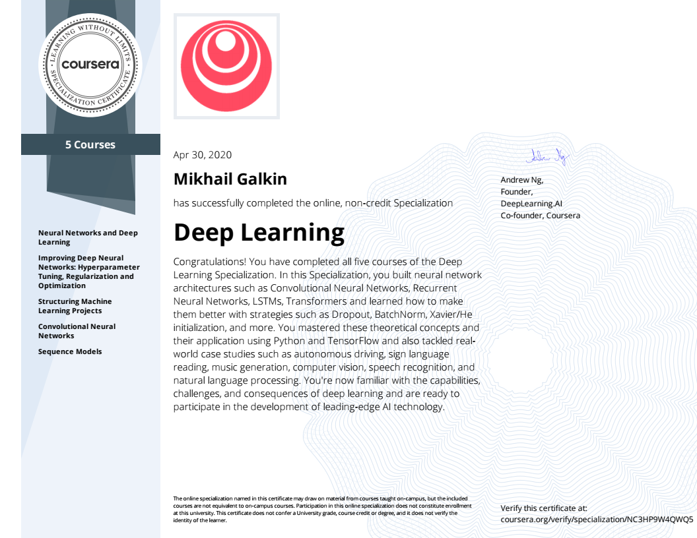

#### This repository contains working notebooks on [Specialization](https://www.deeplearning.ai/program/deep-learning-specialization/) offered by [DeepLearning.ai](https://deeplearning.ai) through Coursera.

There are 5 Courses in this Specialization:
1. [Neural Networks and Deep Learning](https://www.coursera.org/account/accomplishments/verify/2AML5MJTSKLC).
2. [Improving Deep Neural Networks: Hyperparameter Tuning, Regularization and Optimization](https://www.coursera.org/account/accomplishments/verify/L99DLM7H3NBL).
3. [Structuring Machine Learning Projects](https://www.coursera.org/account/accomplishments/verify/YP262775LTDD).
4. [Convolutional Neural Networks](https://www.coursera.org/account/accomplishments/verify/2VJUZSNFCAT6).
5. [Sequence Models](https://www.coursera.org/account/accomplishments/verify/PS22E7PVV9TW).

#### Specialization Certificate
I've successfully completed all courses at the specialization and earned my [certificate](https://www.coursera.org/account/accomplishments/specialization/NC3HP9W4QWQ5)!

